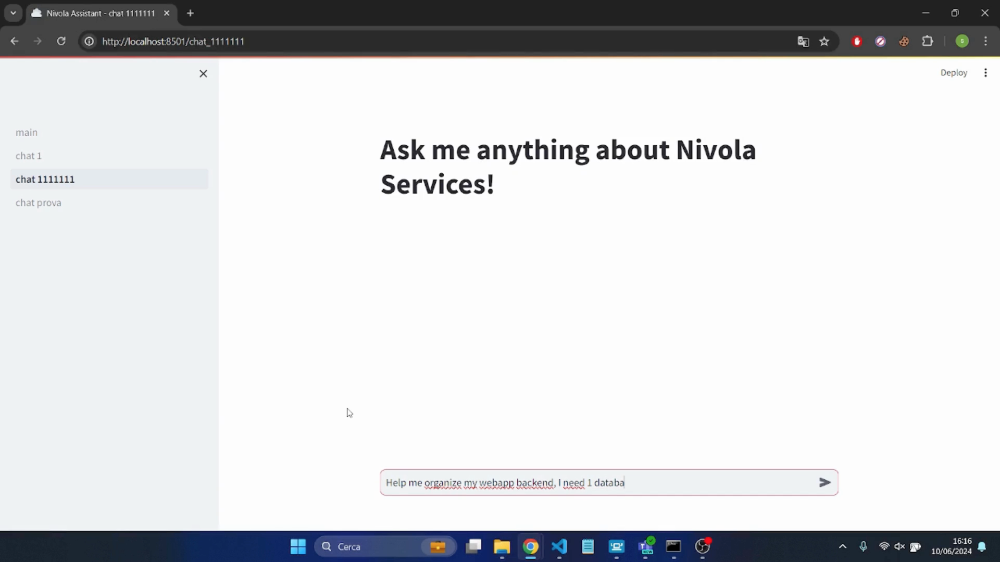
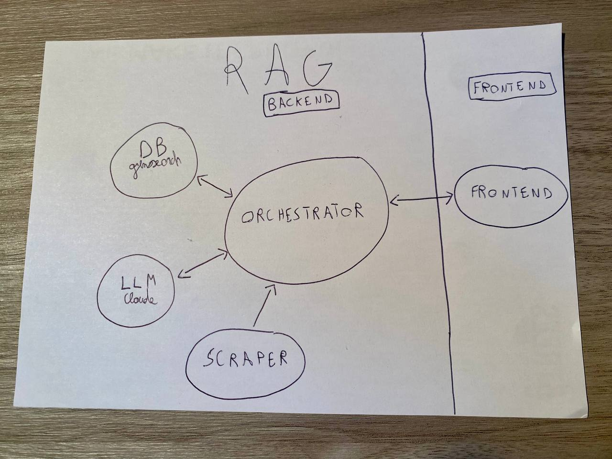
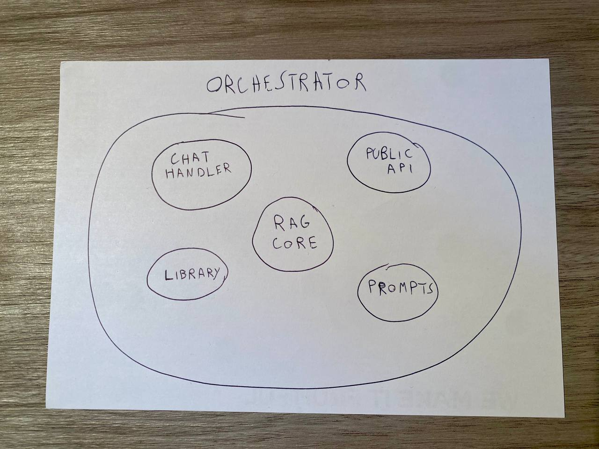
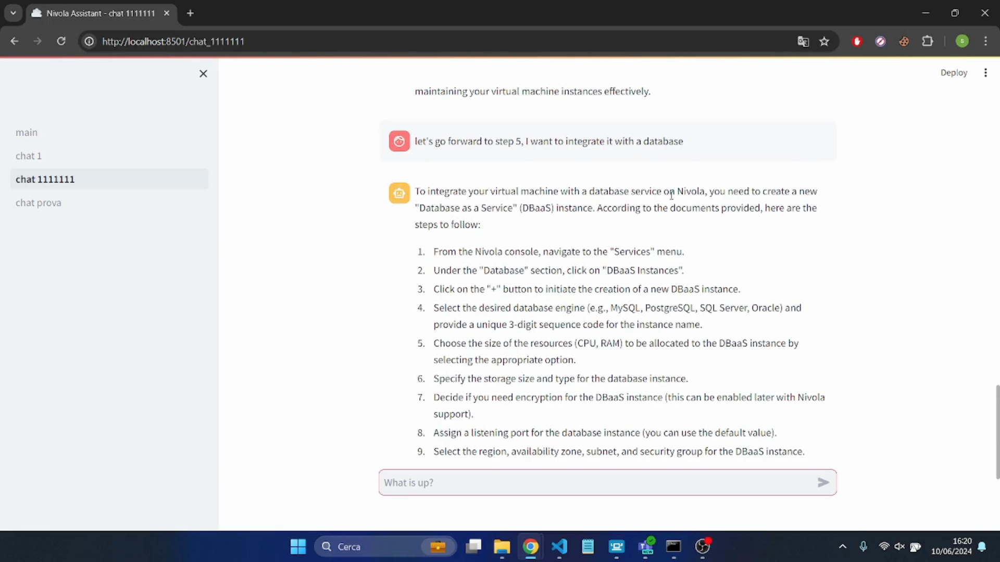

# Ottimizzazione dell'Assistenza Clienti con RAG e LLM

## Tesi ITS Piemonte Fintech Software Developer

## Indice

- 1 - Introduzione
    - 1.1 - Fortuna
    - 1.2 - Metodologia di lavoro
        - Prima Fase
        - Saper Scegliere
        - Filosofia di progettazione
        - Seconda Fase
        - Strumenti utilizzati
    - 1.3 - Azienda e contesto Lavorativo
    - 1.4 - Glossario AI
- 2 - RAG in 3 punti!
    - 2.1 - Perchè?
        - Il RAG crea empatia?
    - 2.2 - Come funziona?
    - 2.3 - Cosa fa?
- 3 - Tutto chiaro, ma cos’è un RAG?
    - 3.1 - Scraper
    - 3.2 - VectorDB
        - Embedding
        - Embedding Model
        - Funzione di distanza
        - Specifiche Tecniche VectorDB
        - Gestione Dati nel DB Vettoriale
    - 3.2 - Prompt
        - Tecniche Utilizzate
        - Parametri LLM
        - Tipologie di Prompt
        - Il Prompt da Sistema
- 4 - Soluzione Finale
    - 4.1 - Flusso di preparazione dati
    - 4.2 - Flusso di risposta
    - 4.3 - Orchestrator
    - 4.4 - Risultato Ottenuto
    - 4.5 - Possibili Miglioramenti
- 5 - Conclusioni

# 1 - Introduzione

Questo documento serve per esporre le esperienze del Project Work, dopo averlo letto si avrà una comprensione generale riguardo a un modo di utilizzare l’Intelligenza Artificiale (IA) per fornire assistenza.

Il project work ha lo scopo di sperimentare alcune tecnologie AI con il fine ultimo di creare un chatbot che assista gli utenti del Service Portal di Nivola, l’interfaccia web del Cloud di CSI Piemonte.

Sebbene possa sembrare un problema informatico, in realtà, assistere un altra persona nella navigazione, comprensione e utilizzo di un sito è di natura strettamente umanistica.
L’informatica e l’intelligenza artificiale sono il mezzo tecnico con cui si risolve il problema.

Invece la soluzione filosofica è l’EMPATIA, 
da dizionario: **Capacità di porsi nella situazione di un'altra persona.**

L’empatia è la capacità che sta alla base di ogni soluzione riguardante aiutare e fornire assistenza, già per definizione è difficile creare empatia, ancora più difficile se uno dei 2 interlocutori è una macchina.

Questi 3 componenti hanno aiutato molto:

- fortuna
- flessibilità mentale
- il giusto approccio al lavoro

## 1.1 - Fortuna

La fortuna si è materializzata in 2 persone e professori dell’ITS:

- Enrico Zimuel
    
    Caso vuole che il secondo giorno di stage veniva presentato il Workshop: Vector Search, ML and Generative AI kibana, 
    tenuto proprio dal professore e un collega di Elastic Search.
    Il Workshop seguito dallo stagista, ha dato la possibilità di successivamente approfondire e capire che la tecnologia esposta nel Workshop era effettivamente la soluzione perfetta al problema postogli nel Project Work.
    
- Fabio Gagliardi
    
    In seguito a una richiesta d’aiuto da parte dello stagista, il professore lo ha aiutato a capire come analizzare le tecnologie richieste al fine di concretamente realizzare una soluzione.
    

## 1.2 - Metodologia di lavoro

Lo stage si può dividere in 2 fasi, quindi 2 metodologie

### Prima Fase

La durata totale dello stage è di 630 ore, la maggior parte delle quali è stata dedicata alla Prima fase che consiste nella:

- comprensione del problema
- analisi delle possibili tecnologie
- progettazione della soluzione finale

La metodologia utilizzata consiste in un loop di 3 passaggi:

1. Studiare
2. Comprendere
3. Applicare

Per Applicare si intende: dopo aver appreso i concetti, realizzare un PoC o esempi pratici.
Questo loop si ripete fino a che non si hanno tutti gli strumenti per definire ed eseguire la soluzione finale.
I PoC e gli esempi pratici, oltre che essere utili per fissare ciò che si è imparato, hanno il fine ultimo di creare esperienza di dominio, che fondamentalmente servirà per definire una soluzione adatta.

I 3 passaggi sono molto chiari e coincisi, ma danno per scontato un aspetto fondamentale:

### Saper Scegliere

Essendo un problema complesso necessità soluzioni altrettanto complesse e articolate.

I primi studi sull’Intelligenza Artificiale possono essere tracciati al lontano 1956, tuttavia solo nell’ultimo decennio le ricerche scientifiche hanno dato dei frutti concreti, fino al 2020, anno di nascita e pubblicazione del paper relativo alla tecnologia utilizzata nella sperimentazione: il RAG.

Senza soffermarsi adesso su cos’è il RAG, l’aspetto importante è che attualmente sono tecnologie in corso di ricerca e sviluppo, nessuno conosce con precisione qual è il modo più efficace di agire.

Per questo esatto motivo è imprescindibile avere una buona comprensione di base e un ottimo intuito per fare le scelte più vicine possibile all’opzione migliore (che potrebbe ancora non esistere).

### Filosofia di progettazione

Modularità, semplicità e chiarezza sono i 3 principi utilizzati per l’intera progettazione.

Progettare modularmente consiste in scomporre un entità in più sotto entità, ognuna con un proprio senso, ciò ha svariati vantaggi:

- uso efficiente delle entità
- definizione esplicita dell’entità
- disambiguità nella funzione di ognuna

I principi di semplicità e chiarezza vengono applicati alla definizione delle entità e sotto entità.

### Seconda Fase

La seconda fase, durata circa 100-130 ore, è servita invece per eseguire la progettazione quindi settare le impostazioni e scrivere il codice.

La metodologia adottata per sviluppare consiste in:

- per ogni punto della progettazione
- definire le task e sotto task se necessario
- assegnare una priorità e una scadenza
- eseguire le task in ordine di priorità
- ogni tanto rivalutare le priorità

### Strumenti utilizzati

Python è stato usato come linguaggio di programmazione nell’intero percorso.

In entrambe le fasi si è fatto larghissimo utilizzo di ChatGPT per generare:

- codice (funzioni)
- esempi di test
- documentazione delle funzioni

ChatGPT è stato fondamentale per avere subito una panoramica delle potenzialità di una libreria sconosciuta o tecnologia sconosciuta, in modo tale da valutarle più velocemente e di più.
Inoltre gran parte del codice finale è stato generato proprio da ChatGPT, ottimo strumento per realizzare ciò che si visualizza chiaramente in testa.

Si è studiato un metodo per avere una chat molto specializzata su python e le attività svolte.
Il metodo identificato consiste nel scrivere più messaggi nella chat, dandogli le istruzioni precise, includendo anche informazioni a contorno come Contesto e Ruolo.

[Qua](https://github.com/ste316/prompts/blob/main/python-expert.md) si possono leggere maggiori dettagli sui messaggi per trasformare ChatGPT in un Esperto Python.

Amazon Web Services (AWS) è stato utilizzato come gateway o host per alcuni servizi.

Rancher Desktop, distribuzione di Kubernetes, è risultato molto utile per hostare un servizio.

## 1.3 - Azienda e contesto Lavorativo

CSI Piemonte è una azienda para-statale, che in italiano significa:
azienda privata i cui clienti sono enti pubblici, per esempio Ospedali, ASL, eccetera.

CSI conta più di 1.000 dipendenti, l’età media si aggira sui 50/55 anni, escludendo gli stagisti la persona più giovane ha circa 30/35 anni, diciamo un ambiente non proprio giovanile, tuttavia l’azienda è molto innovativa ed offre: 

- orari flessibili
- corsi formativi ed eventi sia in presenza sia online
- occasioni di sperimentazione

L’azienda è strutturata in divisioni e sotto divisioni, offrono ai clienti una miriade di servizi, di cui la maggioranza usa i servizi Cloud, parte fondamentale per ogni sito web e servizio.

Durante lo stage è stata assegnata una posizione all’interno della divisione Infrastrutture, che si occupa di gestione, mantenimento e aggiornamento sia hardware che software dell’infrastruttura Cloud, infine dell’assistenza verso i clienti utilizzatori.

L’inserimento è avvenuto nel team di sviluppo Nivola Engineering e seguito giornalmente dal tutor Ahmad Nazha e mensilmente dal tutor Fulvio Claro.

## 1.4 - Glossario AI

Per capire il contenuto del documento è fondamentale avere una conoscenza di base di alcuni termini e concetti:

LLM

Forma contratta di Large Language Model, esempio: GPT-4, 
Sono modelli linguistici allenati su enormi quantità di testo.
Sono così potenti e all’avanguardia che hanno la capacità di generare testo similmente a una persona, con la caratteristica di essere impostati in linguaggio naturale senza necessità di codice.

Ad esempio gli si può chiedere di generare una poesia riguardo le scatolette di tonno con lo stile di Ungaretti.
Gli utilizzi sono infinti, gli LLM hanno una buona capacità cognitiva, possono pianificare e strutturare un processo, analizzare testi, dati numerici e immagini per ricavare ogni tipo di informazione.

Prompt

Richiesta a un LLM, 
essa può contenere una questione irrisolta, dei dati da analizzare o delle istruzioni precise per portare a termine una task definita.

Prompt Engineering

Materia che studia le tecniche di scrittura dei Prompt.
Certe parole, modi di scrivere il testo e di organizzarlo permettono di ottenere una risposta migliore dal LLM.
Sfruttando il Prompt Engineering è possibile trasformare LLM in un Agente specializzato che risponde come un programmatore esperto oppure come un insegnante di fisica.

---

# 2 - RAG in 3 punti!



Cos’è un RAG rispondendo a 3 semplici domande:

## 2.1 - Perchè?

La prima domanda, nonché la più importante: tra le N opzioni disponibili perchè si è scelto di sviluppare un RAG? 

Inanzittutto il Problema è:

- Come fornire assistenza automatizzata agli utenti di una piattaforma online?

Le soluzioni classiche sono:

- Frequently Asked Question
    
    Molto semplicemente stilare una lista di domande che soddisfino le richieste più comuni.
    Opzione largamente utilizzata oggi, garantisce la copertura fino a un certo punto, le domande più semplici possono avere una risposta facilmente interpretabile senza ulteriori spiegazioni.
    Il Problema però sotto intende il bisogno di comprensione dettagliata, fornire assistenza non è dare una singola risposta secca e predefinita, quindi verosimilmente la domanda sarà più articolata e specifica.
    
    Sono quindi percorribili 2 strade:
    
    - ✅ esiste una FAQ simile
    in questo caso è logico assumere che la lista schiantata sul sito contenga un gran numero di domande, intanto chapeau ai gestori del sito per la dedizione, però pochi utenti vogliono veramente leggere un elenco sterminato di domande per trovare quella che più si avvicina alla loro
    - ❌ non esiste una FAQ simile
    casistica più frequente rispetto alla prima, l’utente dopo brevi o lunghe ricerche nel sito, se non ha cambiato venditore, dovrà alzare il telefono o mandare una mail al supporto (seconda soluzione classica).
    
    Esistono soluzioni intermedie che alleggeriscono il carico dell’utente nel cercare tra molte FAQ, ma persiste un altro problema, queste domande e risposte frequenti vanno prima di tutto identificate come frequenti e stilate in modo da essere utili in più casistiche.
    
- Supporto 1 a 1
Consiste nell’assumere, formare infine dedicare un numero variabile di persone per rispondere agli utenti.
Generalmente è impossibile non avere il supporto clienti, deve esistere un contatto umano.
Questa soluzione non è automatizzata e richiede molte energie, è sicuramente la soluzione ideale per il cliente, non per l’azienda.
- Documentazione
    
    La documentazione consiste in un sito web dedicato a descrivere tutte informazioni relative a un prodotto o servizio, possono essere molto ben fatte e dettagliate, quindi molto utili per rispondere a una grande varietà di domande.
    
    Ci sono dei problemi correlati però:
    
    - il contenuto è generalmente esteso e utilizza un linguaggio tecnico
    - rendendo le informazioni difficilmente consultabili per la maggior parte degli utenti
    - scarsa esperienza utente

Le soluzioni innovative testate:

- AWS Lex
è un chatbot conversazionale offerto da Amazon Web Services, funziona per intento dell'utente.
L’intento dell’utente è il suo obiettivo, ad esempio ricevere informazioni su un servizio.
Lex leggendo cosa scrive l’utente della chat determina un intento e inizia il flusso predefinito, ad esempio per adempire all’intento X è necessario che l’utente scriva ulteriori informazioni X1, queste informazioni vengono elaborate al fine di adempire l’intento.

Sembra molto utile e funzionale, ma ha delle criticità importanti:
    - ogni singolo intento va definito a priori ed è statico
    - gli intenti vengono rilevati da un algoritmo interno che sfrutta una lista di frasi passate nella definizione dell’intento
        - non si può conoscere la tecnologia dell’algoritmo interno
        - non si sa quante frasi sono necessarie
        - non si ha la certezza che l’intento rilevato sia corretto
    - l’interfaccia di definizione intenti ha una esperienza utente pessima
        - ci sono tantissime opzioni nascoste in menù secondari e terziari
        - è un processo lungo e senza possibilità di facile automazione
        - avere un gran numero di intenti è impensabile
        
    
    Il risultato finale ottenuto è un assistente stupido e limitato ai flussi predefiniti.
    
    Il resoconto in 3 punti:
    
    - gran numero di ore ed energie richiesti
    - assistente veramente poco intelligente
    - facilità nel mantenere e aggiornare la soluzione da 1 a 10: -2
- AWS Kendra
Kendra è un motore di ricerca che sotto il cofano utilizza l’intelligenza artificiale per migliorare gli indici utilizzati.
Avendo una o più fonti di dati si può avere un motore di ricerca simile a Google, ritorna i documenti più rilevanti e può persino evidenziare parte di un singolo documento con la risposta alla domanda effettuata.

Ha diverse caratteristiche che non lo rendono utile nella risoluzione del Problema:
    - è un motore di ricerca, non un assistente
    - non si sa realmente com’è strutturato il sistema di indicizzazione
    - ha uno scopo differente
- LLM
Ne esistono vari e molto potenti, ad esempio: GPT-4 e Claude 3. 
Vedi definizione nel Glossario.
Hanno una grande capacità di conversazione, sono poliglotti e si adattano a ogni situazione, ma hanno dei problemi intrinsechi:
    - Allucinazione degli LLM
    Chi ha usato ChatGPT sa che a qualunque domanda viene ritornata una risposta.
    Sai stabilire quando la risposta è corretta? E quando è sbagliata, ma vero-simile (allucinata)? Conosci le fonti da cui è stata generata la risposta?
    - Mancanza di Dati Post-Training-Date
    I Modelli Linguistici Larghi necessitano per loro natura tantissimi dati per essere creati (train).
    Il tempo e tutta la potenza computazionale necessaria rendono semplicemente impossibile riaddestrare un modello ogni qualvolta ci siano nuove informazioni importanti.
    
    Ad esempio le news giornaliere di oggi rimangono sicuramente escluse dal set di informazioni disponibili.
    - Mancanza di Conoscenza di Dominio
    Sebbene gli LLM abbiano ingerito un enorme quantità di dati, non sono onniscienti.
    Certe informazioni di specifici domini non esistono dentro a un LLM.
    - Mancanza di un limite conversazionale
    Essendo addestrati con moltissimi dati, possono rispondere a tantissime domande, in un contesto di assistenza aziendale non va assolutamente bene.
    Gli utenti potrebbero chiedere qualunque argomento totalmente fuori contesto e avrebbero una risposta.

Per rispondere alla domanda principe, perchè il RAG?

Il RAG è una fusione delle soluzioni:

- LLM
- documentazione

Il RAG sfrutta una documentazione per risolvere i problemi degli LLM, permettendo una soluzione più affidabile e controllabile, pur mantenendo le grandi potenzialità di un LLM e anzi aumentarle per ciò che è realmente necessario all’utente.

In poche parole un RAG ti permette di dialogare facilmente con la documentazione o altri contenuti, con il grande plus di essere in grado di modulare la risposta per essere più facilmente compresa in base a come è posta la domanda.

### Il RAG crea empatia?

A inizio documento è stata definita l’Empatia come soluzione fondamentale, ma il RAG crea empatia?

Dal punto di vista dell’utente SI ✅, 
per via della modalità testuale è facilmente assimilabile a una chat con un altra persona. 
Lo strumento è ottimale, ovviamente l’empatia creata dipende dalla chat in sè per sè, usando un LLM le risposte si adattano molto bene alla domanda posta.

Tuttavia questi strumenti molto potenti hanno dei limiti, sempre più larghi, ma hanno dei limiti.
Inoltre una persona non è sostituibile da nulla, ad oggi è impossibile replicare il contatto umano e l’esperienza di una conversazione faccia a faccia, chissà tra qualche anno/decennio.

## 2.2 - Come funziona?

Un RAG si può chiamare tale, se si assicura di fornire al LLM tutti i documenti utili per fornire una risposta corretta, aggiornata e informata.

Entrando più nello specifico, un RAG si interfaccia con una o più fonti esterne di documenti, che possono essere pagine wikipedia, documentazioni tecniche o altro.

Come fa LLM a interfacciarsi con la fonte esterna?

LLM è una scatola chiusa che ha una sola apertura (prompt), i testi mandati, percui l’unico modo esistente è fornire i documenti aggiuntivi da essa.

Il prompt è composto da:

- la domanda
- i documenti esterni
- le istruzioni per usare i documenti e rispondere in modo appropriato

Come decidere quali documenti mandargli?

Entra in gioco un database ‘magico’ che permette la ricerca semantica, è una speciale ricerca basata sul contesto e significato di un testo.

Come funziona il database ‘magico’?

Indicizza tutti i documenti per contesto e quando viene interrogato calcola il contesto della domanda per ritornare i documenti che più si avvicinano ad essa.

## 2.3 - Cosa fa?

Il workflow del RAG è:

- Question: l’utente fa la domanda
- Retrieval: tramite il database ‘magico’ vengono trovati i documenti
- Generation: LLM usando il prompt fornito, si occupa di comprendere domanda e documenti per generare una risposta adeguata

---

# 3 - Tutto chiaro, ma cos’è un RAG?

Per far comprendere bene il concetto astratto di RAG, si prenda come metafora un professore, dotato di una certa capacità espositiva e la conoscenza della materia insegnata.

La metafora si usa per comprendere un concetto complesso utilizzandone un altro più semplice con caratteristiche paragonabili, ma non uguali.
Per definizione perciò la metafora evidenzia le caratteristiche in comune, tralasciando le rimanenti. È tuttavia molto utile per avere un primo approccio ad esso.

Continuando la metafora del docente, la conoscenza della materia equivale ai Documenti, la capacità espositivà viene definita nelle istruzioni del Prompt e la memoria del professore equivale al VectorDB.

Notare come conoscenza e memoria siano 2 concetti ben distinti, in quanto si può conoscere per filo e per segno un argomento, ma senza memoria non lo si può sfruttare nel momento richiesto.

 

I componenti del RAG sono:

- Documenti
    
    Rappresentano la Conoscenza, il succo di tutta la tecnologia si basa sull’affidabilità dei Documenti, è quindi fondamentale la ricerca e la gestione di essi 
    
- VectorDB
    
    Rappresenta il Modo per Recuperare la Conoscenza efficientemente, è un DataBase ‘magico’ che permette in modo facile e veloce di trovare i documenti che più si avvicinano al contesto della domanda.
    
- Prompt
    
    Rappresenta la Personalità di chi esporrà la Conoscenza, è un testo che contiene delle istruzioni chiare e precise riguardo a come generare la risposta, come esporla e persino quale lessico utilizzare.
    

## 3.1 - Scraper

Nel Project Work la conoscenza utilizzata è tutto ciò che riguarda il Cloud di CSI (Nivola Service Portal).

Si è proceduto con la creazione dello scraper ([codice sorgente qui](https://github.com/ste316/scrape_script/tree/main/nivola-wiki-scraper)) per il sito contenente la [documentazione di Nivola](https://nivola-userguide.readthedocs.io/it/latest/).

Cos’è un web-scraper?

Scraper fa riferimento al grattare informazioni dai siti web, nello specifico, effettua richieste HTTP come una classica ricerca su google in modo simile a un utente reale, ma viene creata da un bot automatizzato che raccoglie sistematicamente i dati e li trasforma in modo da essere successivamente elaborati da altri componenti software.

Prima di creare lo scraper si è proceduto ad analizzare il codice sorgente delle pagine html:

- scoperta: il contenuto ricercato esisteva esclusivamente nei html tag: section
- scoperta 2: esiste una [pagina indice](https://nivola-userguide.readthedocs.io/it/latest/) che permette l’accesso a tutte le altre
- ora si hanno tutti gli strumenti per iniziare a scrivere il codice

Dopo aver scritto il codice di base per prendere le informazioni dal sito, la successiva gestione e manipolazione di esse è stata guidata dalle esigenze che mano a mano venivano identificate per il funzionamento del RAG.

Il sito è diviso in categorie e sotto categorie, ogni pagina descrive un aspetto di Nivola, dai tutorial passo passo per utilizzare la Cloud Platform alle release note di ogni versione.
Ogni pagina html contiene uno o più Section tag, ecco un esempio di rappresentazione dei dati che lo scraper genera da una sezione.

```json
{
    "hash": "5bab9d46c71ae2b50214749d86fba7a5fcac4cdcf8dedb3c0a85de3d051b79d7",
    "link": "https://nivola-userguide.readthedocs.io/it/latest/Linee_guida/9.8_utenti_privilegiati_Ruoli_e_diritti.html#utenti-ruoli-ed-account",
    "title": "utenti ruoli ed account",
    "category": "linee_guida/utenti_ruoli_ed_account",
    "keywords": "utenti, account, ruoli, master",
    "list": [
        "Un Master di Organizzazione può accreditare o revocare utenti all'interno delle proprie divisioni o account",
        "Un Master di Divisione può accreditare o revocare utenti all'interno dei propri account e della propria divisione.",
        "Un Master di Account può accreditare o revocare utenti all'interno del proprio account.",
        "L'Amministratore di Backoffice può accreditare o revocare ruoli agli utenti a qualsiasi livello della struttura gerarchica."
    ],
    "table": {},
    "required_role": [],
    "text": "si possono distinguere più ruoli all'interno della piattaforma...",
    "category_en": "guidelines/users_role_and_accounts",
    "keywords_en": "users, accounts, roles, master",
    "text_en": "multiple roles can be distinguished within the platform..."
}
```

I dati più importanti sono:

- hash
    - identificatore univoco
    - funzione hash: keccak-256 dell’attributo text
- category e category_en
    - permettono una veloce scrematura dei dati
    - sono composte da 2 parti
        - il nome della macro categoria e
        - dal titolo della sezione specifica
- text e text_en
    - costituiscono il contenuto della sezione

NOTA: en alla fine degli attributi fa riferimento alla lingua del testo

NOTA: text, text_en e category_en giocheranno un ruolo fondamentale nel VectorDB

Queste sono le informazioni utili per comprendere il RAG, però al fine di raccontare cosa si è fatto durante lo stage ecco le funzionalità avanzate dello scraper:

- traduzione automatica Italiano - Inglese
    - sul sito la documentazione è disponibile solo in Italiano
    - viene usata l’API di [DeepL](https://deepl.com/) per tradurre
- controllo dei duplicati
    - quando l’opzione override è disabilitata
    - viene controllato se la sezione scrapata è presente nel file db.json o meno
    - in caso positivo non viene aggiunta, evitando duplicati
- riconoscimento avanzato del testo
    - liste html e liste non strutturate all’interno dei testi sono estratte in un attributo separato
    - identificazione delle keywords più rilevanti
    - identificazione dei requisiti di ruolo per accedere a una sezione della Cloud Platform

Lo scraper viene eseguito ogni volta che c’è un aggiornamento della documentazione, non è stato creato nessun automatismo che rilevi quando c’è una modifica.

## 3.2 - VectorDB

Ecco la spiegazione del database ‘magico’.

Per capire cos’è un DataBase Vettoriale serve conoscere 3 cose:

- DataBase, leggere [questo link](https://universeit.blog/database-cosa-e/) per comprenderli
- Embedding e Embedding Models
- Funzione di distanza

### Embedding

Gli Embedding spiegati facilmente sono la rappresentazione numerica di un entità.
Dove l’entità è un oggetto reale, ad esempio una parola, un testo articolato, persino un immagine o un video.

Un embedding è un vettore con N dimensioni, si parla di centinaia di dimensioni, quindi banalmente una serie di, ad esempio, 300 numeri che identificano il contesto semantico dell’entità.

### Embedding Model

Gli embedding model sono reti neurali specializzate nel catturare il significato semantico di un testo per generare il relativo embedding.

In base al modello scelto gli embedding vengono generati in modo differente, bisogna quindi scegliere con cura quale si usa.

Un embedding model è addestrato in modo tale da ricevere un testo generico e dare in output un vettore di N dimensioni, dove N è fisso. 
Sia l’embedding di ‘ciao’ che l’embedding di ‘ciao mondo’ ripetuto 30 volte hanno la stessa lunghezza.

### Funzione di distanza

La funzione di distanza è una formula matematica che viene usata per determinare la distanza semantica trai documenti, esempio: Cosine Similarity

La funzione viene utilizzata nell’algoritmo kNN (k Nearest Neighbors) per classificare i documenti e poi calcolare la distanza tra essi.

Mettendo tutto assieme si ottiene un database che crea un indice semantico, si può paragonare al bibliotecario in una biblioteca, chiedendo dove si trova la sezione dei libri di economia ti sa dare una posizione specifica negli scaffali.

Si può decidere quali dati indicizzare, ad esempio invece che esclusivamente la categoria di libro si può indicizzare anche l’autore e il titolo.
Così facendo è possibile avere diversi risultati in base al bibliotecario a cui si chiede le informazioni, combinarle e trovare definitivamente il libro/libri voluti.

Questa è l’esatta strategia implementata nel RAG, definito l’embedding model, si è definita la struttura dell’indice in modo tale da poter cercare i documenti tramite più bibliotecari.

### Specifiche Tecniche VectorDB

Il database usato è Opensearch, un fork di Elastic Search.

La scelta del Vector DB è stata pesantemente influenzata dal vincolo di utilizzo di AWS imposto dall’azienda ospitante

Inizialmente si è creata un istanza serverless di Opensearch, per comodità è stato poi installato in locale nel computer aziendale attraverso Rancher Desktop, una distribuzione di Kubernetes.

Per effettuare la ricerca si è creato un indice con le seguenti caratteristiche:

- embedding model: [sentence-transformers/all-MiniLM-L12-v2](https://huggingface.co/sentence-transformers/all-MiniLM-L12-v2)
- funzione di distanza: cosine similarity
- attributi usati per ricerca semantica:
    - testo italiano
    - testo inglese
    - categoria inglese

Per scegliere gli attributi da utilizzare nella ricerca semantica si è partiti dai dati dello scraper, il testo rappresenta il contenuto del documento, sarebbe stato senza senso non includerlo, invece la categoria è stata studiata apposta per rappresentare la sezione in poche parole, anche in questo caso sarebbe stata una scelta sbagliata non includerla.

Con successive prove si è potuto confermare l’efficacia degli attributi scelti e notare che 

- se sia la query che l’attributo di ricerca sono in inglese
    - il risultato è ottimale
- se la query è in italiano e l’attributo di ricerca inglese
    - il risultato è accettabile
- se la query è in italiano e l’attributo ricerca italiano
    - il risultato è a volte accettabile, a volte no

Per scegliere modello di embedding, funzione di distanza e i parametri per l’algoritmo kNN non è stato possibile seguire un ragionamento intuitivo, ma è stato usato un approccio brute-force, cioè si è proceduto testando le opzioni disponibili, provando a scartare di volta in volta le peggiori.

Perchè non è stato possibile decidere in altro modo?
Semplicemente mancavano le basi matematiche per poter capire come funziona in dettaglio sufficiente l’algoritmo kNN a tal punto da poter definire i parametri senza testarli uno ad uno.
Lo stesso vale per il modello di embedding.

### Gestione Dati nel DB Vettoriale

Generalmente per utilizzare i database vettoriali si effettua il Chunk Size, cioè la pratica di dividere un testo in segmenti con lunghezza uguale e con un overlap (ripetizione di una porzione di testo tra fine di un chunk e inizio di un altro) con lo scopo di aumentare l’accessibilità semantica del testo.

In questo caso non è stato utilizzato nessun chunk size perchè la documetazione era gia strutturata e divisa semanticamente, ogni sezione aveva un titolo, scopo e senso proprio.

I documenti sono quindi stati caricati con la lunghezza originale.

## 3.2 - Prompt

I prompt sono specifici per LLM scelto, nella sperimentazione è stato scelto Claude 3 Sonnet.

Claude è sviluppato da Anthropic, azienda fondata da un gruppo di ex-dipendenti di OpenAI preoccupati dalla sicurezza della tecnologia (AI safety).

Il processo di scrittura prompt è complesso perchè richiede molte prove e aggiustamenti, tuttavia ci sono delle linee guida e tecniche suggerite da Anthropic stessa che ha dedicato parte della documentazione proprio per spiegare come scrivere i prompt.

Il prompt è stato definito per servire a 3 scopi:

- capire se la domanda è in contesto
- capire se c’è abbastanza conoscenza disponibile per rispondere
- produrre la risposta nel modo più completo e accurato possibile

### Tecniche utilizzate

La principale tecnica utilizzata è strutturare il prompt in tag XML per:

- dare senso al testo all’interno
- far riferimento a una sezione
- dare istruzioni riguardo a dove scrivere l’output

Due principi fondamentali sono la lingua inglese e la chiarezza, è necessario scrivere chiaramente cosa deve fare LLM, meglio usare elenchi puntanti e casistiche ben definite.
Per scrivere un prompt bisogna avere in mente che LLM è un ottimo esecutore quindi le istruzioni devono essere limpide.

Per lo stesso principio di chiarezza, oltre a definire la task è stato scritto come sono strutturati i documenti e come leggerli, le modalità da usare e un simil flowchart per la produzione della risposta.

Il flowchart è un elenco puntato che spiega passo per passo cosa fare, ma non bastava, è stato usato uno speciale tag XML: ***<Inner Monologue (Claude)>*** per dare un esempio concreto di ragionamento.

### Parametri LLM

Come detto in precedenza, gli LLM sono delle scatole chiuse che hanno una apertura, i prompt o i testi mandati, e alcuni parametri che ne influenzano il comportamento.

L’unico parametro utilizzato è la temperatura:

- numero da 0 a 1
- regola la creatività del LLM
- 0 → deterministico, 1 → creativo

Per la sperimentazione, la temperatura è stata impostata a 0 per assicurare una risposta ragionata ed evitare la creazione di nuovi dati da parte del LLM.

### Tipologie di Prompt

I prompt possono essere passati in 2 modi, come utente e come sistema. 

La differenza è che il prompt da sistema viene mandato una volta e instrada LLM a rispondere.
I prompt da utente invece sono i singoli messaggi che l’utente scrive, possono comunque contenere tecniche di prompting oltre al messaggio dell’utente in sè.

Il prompt dell’utente utilizzato è molto semplice:

```
Documents: {docs}
Question: {question}

Provide the answer following <Instructions>.
```

‘docs’ contiene i documenti trovati, ‘question’ è la domanda dell’utente.
C’è anche un promemoria per far seguire bene le istruzioni. 

### Il Prompt da Sistema

Di seguito il prompt passato da sistema:

```markdown
<Task Instruction>
<Task>
You are the fabulous site assistant of Nivola Cloud.  Answer the questions using the documents provided.  You like answer question.
</Task>

<Instructions>
You will be prompted with 2 inputs:
- a collection of documents with the highest context-similarity score
- a user question, you will have to understand whether it is in context or not

I'm going to define 3 things you gotta know:
<document-specification>
Each document, identified by a string of 64 chars, contains:
1. similarity score, related to the Question, the score is a float number that range from -1 to 1:
- score = -1, means 100% different topic
- score = 0 , means 100% neutral topic
- score = 1 , means 100% similar topic
2. category, label and identify the Document.
3. text, the body of the Document itself.
</document-specification>

<mode>
To actually answer, you will proceed step by step, steps described in <steps-to-answer> section below.
Make sure that the final answer doesn't contain phrases like: 'in the document provided' or 'according to document 1'.
Make sure to answer in the same language of the question.
Make sure to produce an easily accessible text, by using bullet or number lists.
Be kind and respectfull.
</mode>

<steps-to-answer>
<preliminary-step>
Ensure the question is lecit.
<Inner Monologue (Claude)>
First thing first, is the question in context?  
I note in <checks> space whether the question is in context with:
- cloud computing
- information technology
- Nivola services and products

Let's analyze <checks>, if the question is in context with even 1 of the 3 points it is a legitimate question, I will proceed to answer it.  Otherwise I will go straight to write in <final-answer> space that I can provide support for in context questions.
</Inner Monologue>
</preliminary-step>

1. understand the question, pay attention to keywords and context.
<Inner Monologue (Claude)>
I read and understand the question target by noting the key concepts in <key-concepts>
</Inner Monologue>
2. clarify ambiguities, if any, ask follow back questions to sort out the question.
<Inner Monologue (Claude)>
1. Do I grasped the user intention?  Do I completely understood the question?
- case: NO
I'm gonna ask further details.
- case: YES
All fine all good.
2. Do I have enough context and information from any document?  If not from any past message?
- case: NO
I'm gonna request the user to write 2/3 keywords to receive more documents.
- case: YES
All fine all good.
</Inner Monologue>
3. select which are the most usefull documents.
<Inner Monologue (Claude)>
The question is now clear to me, let's think how to answer properly...
Are there documents available? 
- case: NO
If not, how can I answer the user question appropriately? Maybe in the past messages there is some kind of answer or infos related? 
I check if any, but how much am I confident with this information?
Now I note which piece of text might be usefull and my conviction score in <no-document-available> space.
- case: YES
If yes, I can analyze them.
Using <document-specification> I read each document, thinking if it can be useful to answer the question.
1. So let's see, higher the similarity score, higher the possibility this document is actually usefull.
2. I proceed to understand if the category is related to the Question.
3. I note the most useful documents inside <usefull docs> space.
</Inner Monologue>
4. before formulating your answer use the five W's framework to organize your thoughts and ideas.
<Inner Monologue (Claude)>
So let's use the five W's, in order to answer it foresees addressing this 5 questions:
- Who
- What
- When
- Where
- Why
I answer this 5 questions in <five w> space.
</Inner Monologue>
5. provide context and backgroud information to effectively explain your response.
6. reason the explanation clearly and concisely.
7. consider multiple perspectives (if applicable), might be usefull to provide a well-rounded answer.
8. write down the answer in <draft-answer> space.
9. review and revise for clarity, coherence, and accuracy
<Inner Monologue (Claude)>
Consider the <draft-answer> I wrote and the <question>, is the answer clear, coherent and accurate?  Is the answer in the same language as the question?
I note True or False in <final-check> space.
If <final-check> is False, I reformulate the answer accordingly.
Once I got a clear, coherent and accurate answer I write it down in <final-answer> space
</Inner Monologue>
</steps-to-answer>

Keeping in mind <mode>, answer questions using <steps-to-answer>.  Make sure to follow <preliminary-step>.
After answering write into <most-usefull-doc> space the most usefull document's identifier. 

IMPORTANT: Wether the checks are passed, not passed, the question is in context or not, remember to write the final answer inside <final-answer> space.
</Instructions>
</Task Instruction>
```

---

# 4 - Soluzione Finale

La soluzione finale è una webapp, in stile ChatGPT, specializzata sulla documentazione di Nivola Service Platform.

Avendo visto come funzionano i singoli componenti del RAG, ecco come si presentano schematizzati: 



## 4.1 - Flusso di preparazione dati

1. scraper: acquisisce tutti i dati
2. orchestrator: procede a caricarli nel db vettoriale
3. db-vettoriale: li ingeste e indicizza

## 4.2 - Flusso di risposta:

1. user: pensa una domanda
2. frontend: permette di scrivere la domanda e la manda all’ orchestrator
3. orchestrator: crea una chat e cerca i documenti migliori per la domanda posta
4. db-vettoriale: elabora la query e ritorna i migliori documenti simili
5. orchestrator: gestisce i documenti e li aggiunge alla chat assieme alla domanda
6. orchestrator: manda la chat (documenti e messaggi) a Claude con il Prompt
7. claude: elabora tutto e manda la risposta finale
8. orchestrator: aggiunge la risposta alla chat e la manda al frontend 
9. frontend: mostra la risposta
10. torna al punto: 0

## 4.3 - Orchestrator

L’orchestrator schematizzato:



I componenti dell’Orchestrator sono:

- Chat Handler
    
    Chat handler si occupa di astrarre la chat per gestire la coerenza dei messaggi e dei documenti utilizzati, è composto da 3 dataclass:
    
    - Message
        - rappresenta un messaggio nella chat
        - composto da:
            - role: str (user o assistant)
            - content: str
    - Docs
        - rappresenta la collezione di documenti utilizzati in una chat
        - composto da:
            - data: dict
                - dict-key: str; hash del documento
                - dict-value: dict; documento
    - Conversation
        - rappresenta una chat
        - composta da:
            - messages: List[Messages]
        - nota:
            - controlla alternanza dei ruoli nella lista di messaggi
            - dovrebbe implementare i documenti, ma per velocità di sviluppo questa logica è stata mossa in Docs, che dovrebbe teoricamente essere solo Doc e contenere un singolo documento.
    
    Le dataclass servono a definire i dati, la loro consistenza e metodi per importarli ed esportarli.
    La logica core di questo componente è nella classe ***conversation_db*** che gestisce:
    
    - le 3 dataclass
    - il database (SQLite) per contenere i dati delle conversazioni
    - recupero, creazione, aggiornamento e cancellazione delle conversazioni
    
- Library
    
    Avere una libreria interna ha lo scopo di astrarre la complessità dei componenti a basso livello per renderli molto più accessibili e facili all’uso nei livelli di astrazione superiore. 
    
    La libreria è composta da più file e classi, le funzioni contenute sono i connettori a basso livello per le parti richieste, come ad esempio:
    
    - gestione di opensearch
    - gestione file e cartelle
    - client AWS
- Prompts
    
    Prompts sono semplicemente le variabili stringhe che contengono i prompt utilizzati
    
- Public API
    
    Permette la comunicazione tra RAG e l’esterno tramite delle API:
    
    - new_chat
    - send_message
- Rag Core
    
    Rag Core è la parte operativa centrale, crea le istanze delle altre classi e permette l’integrazione e comunicazione tra esse al fine di generare una risposta.
    
    La maggior parte del codice è dedicato a modificare i dati presi in output da un entità per farli combaciare con l’input di un altra entità.
    Per i dettagli tecnici leggere il codice e le doc-string delle funzioni.
    

Per maggiori dettagli, [visitare la repository github con il codice](https://github.com/ste316/rag-nivola-service-portal).

## 4.4 - Risultato Ottenuto



Il risultato ottenuto da questa soluzione è un chatbot abbastanza intelligente che permette di ricevere informazioni riguardo la comprensione e l’utilizzo della piattaforma cloud Nivola Service Portal, [ecco un video demo per vedere come risponde](https://github.com/ste316/tesi-rag-assistente/blob/main/demo-assistente-rag.mp4).

Dopo aver testato l’assistente, è stato valutato come un buon aiutante per comprendere come muoversi nella piattaforma, avere informazioni di utilizzo dei servizi e anche strutturare piccole architetture.

Per fare un paragone con le soluzioni classiche (FAQs e Supporto 1:1), l’assistente indubbiamente non può sostituire il supporto 1 ad 1 perchè non è un assistente operativo:

- ad esempio se un database non funziona non può aggiustarlo
- non è collegato alle API della piattaforma, non può istanziare un servizio cloud su richiesta dell’utente

D’altro canto però, quando il problema dell’utente è puramente informativo questa soluzione è oggettivamente migliore sia di Supporto 1:1 che FAQs perchè:

- è facilmente accessibile, basta scrivere in chat
- è attivo 24/7
- ha la capacità di spiegare approfonditamente

Una pecca strutturale è sicuramente la dipendenza dai servizi di Anthropic, possono aumentare il prezzo a loro discrezione come possono anche ritirarlo dal mercato, anche se improbabile.

## 4.5 - Possibili Miglioramenti

Il Project Work ha avuto una durata di 630 ore, delle quali la maggior parte è stata utilizzata per analisi e progettazione, invece la parte di sviluppo è stata compressa in 100-130 ore.

Il tempo è stato massimizzato per creare una soluzione funzionante al 100% senza però tenere in conto dei miglioramenti previsti originariamente nella progettazione.

Ecco un elenco dei miglioramenti previsti e non eseguiti, che avrebbero ridotto in modo significativo i tempi di attesa:

- Cache documenti
    
    Cache documenti permette di archiviare i documenti più richiesti in un database veloce da interrogare, in modo da ridurre le richieste verso OpenSearch
    
- Chat Condensation
    
    Chat condensation significa riassumere gli ultimi N messaggi in modo da mandare meno messaggi da analizzare al LLM senza però perdere contesto nella conversazione.
    
- Riduzione Risposta
    
    Premessa: 
    nell’attuale implementazione il prompt specifica al LLM certi spazi per ragionare (quindi scrivere dati aggiuntivi nella risposta) e produrre una risposta molto più accurata, questi spazi in termini di archiviazione pesano molto, potrebbero essere uguali o maggiori di 2 volte rispetto la risposta finale visualizzata dall’utente.
    
    Riduzione risposta significa quindi salvare solo <final-answer>, questa semplice modifica
    
    - migliorerebbe molto i tempi di risposta
    - ridurrebbe il volume delle chat
    - semplificherebbe la gestione della risposta stessa
- Bypass AWS
    
    Premessa 1: 
    uno dei vincoli posti dall’azienda era l’utilizzo di AWS nella sperimentazione, infatti all’origine era previsto l’hosting di OpenSearch Serverless su AWS e l’uso di uno o più AWS Lambda per eseguire tutto il codice del RAG.
    
    Premessa 2: 
    LLM è utilizzato attraverso le API di AWS Bedrock che poi le inoltra verso Anthropic, aggiungendo complessità non richiesta e un delay nella risposta.
    
    Il miglioramento consiste in integrare direttamente le API di Anthropic, estromettendo completamente AWS.
    
- User Feedback
    
    User Feedback è finalizzato a raccogliere feedback dagli utenti e consiste in:
    
    - dopo aver risposto alla domanda
    - chiedere un voto all’utente
    - raccogliere risposta e voto
    - analizzare il dataset con un LLM per estrarre lacune del prompt o dei documenti e altri miglioramenti vari

Ecco invece una lista dei componenti esterni alla progettazione che migliorerebbero le performance complessive:

- User Question Analyzer
    
    Componente che mira a trovare i soggetti di ricerca nella richiesta dell’utente per fare una ricerca molto più accurata nel Database Vettoriale.
    
    Infatti cercando una frase intera si perde un po di accuratezza rispetto a cercare solo le parole chiavi.
    
    Trovare tutte le parole chiavi è una task difficile, questo componente sarebbe usato per una parte delle query verso Opensearch e l’output (i documenti trovati) sarebbero poi aggregati ai risultati delle query con la domanda completa.
    
    Pro
    
    - risposta più precisa
    
    Contro:
    
    - molto studio per comprendere il giusto modo di analizzare il testo
    - complessità maggiore
    - possibili rallentamenti nella risposta
- Document re-Ranker
    
    Nell’attuale implementazione tutti i documenti salvati in una chat vengono rimandanti al LLM ad ogni domanda, questo componente permette di mandare i documenti relativi solo all’ultima domanda.
    
    Perchè è necessario?
    In una chat possono essere toccati argomenti diversi, contenuti in svariati documenti, rendendone alcuni non necessari alla risposta.
    
    Pro
    
    - meno costi: riduzione volume dati mandato al LLM
    - risposta più precisa
    
    Contro:
    
    - complessità lievemente maggiore
    - possibili rallentamenti nella risposta
- Nivola API Integration
    
    Come detto nel capitolo 4.4, l’assistente non è collegato alle API della piattaforma, però è implementabile con un certo impegno ed energie.
    
    Questo miglioramento permetterebbe all’utente, anche senza sapere tutte le specifiche tecniche, di esser guidato nella gestione dei servizi integrati.
    
    Pro
    
    - gestione servizi semplificata notevolmente
    - esperienza utente migliorata
    
    Contro
    
    - complessità decisamente maggiore
    - possibilità di dover riorganizzare parti importanti dell’architettura

---

# 5 - Conclusioni

L’esperienza di Stage è stata molto intensa e altrettanto formativa.

Integrarsi nel contesto lavorativo di CSI specialmente all’inizio non è stato per nulla facile per:

- Differenza di Età
- Mentalità rispetto al Lavoro
    
    Mentalità rispetto al lavoro si intende lavorare o meno in modo dinamico e senza seguire a priori una linea già tracciata da qualcun altro.
    Come si intende anche avere la flessibilità di lavorare in orari differenti e non sempre dalle 8:15 alle 17:15, con pausa pranzo di un ora dalle 12:30 alle 13:30.
    
- Modo di Lavorare
Modo di lavorare invece fa riferimento alla pacatezza e calma nell’eseguire le richieste.
Sicuramente influenzato dal contesto aziendale para-statale e dall’attesa dei bandi.

Queste difficoltà, con l’aiuto dei compagni di stage dell’ITS, sono state superate, aumentando la capacità di adattamento in un contesto differente.

Dal punto di vista di ricerca, progettazione e sviluppo si è proceduto quasi sempre in solitaria.
Dopo aver parlato con i tutor, si è acquisita una maggiore consapevolezza sulle proprie capacità e limiti.
Notando che:

- si è raggiunta una buona autonomia nel portare avanti dei task di ricerca e sviluppo in solitaria,
- mancano certe fondamenta di matematica e statistica,
- si è sviluppata una buona capacità di discussione riguardo le scelte tecniche

Analizzando quindi la parte comunicativa, lo stage è stato fondamentale per migliorare nell’esposizione durante una riunione come anche nell’esposizione uno ad uno finalizzata a trasmettere un’idea a 360 gradi.

Infine un commento personale, il percorso di stage in azienda è servito per aumentare la consapevolezza di quanto il tempo abbia valore, nello specifico credo che per me fare un lavoro classico, per intenderci ufficio 9-18, sia la morte dell’anima e credo anche che il futuro sia nell’automazione di ogni cosa automatizzabile.